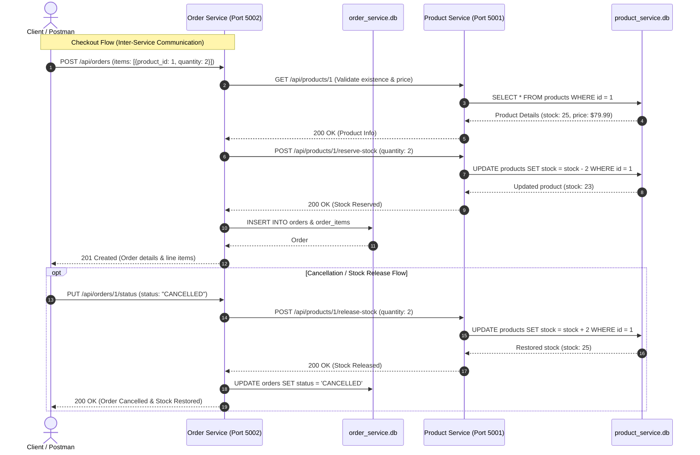
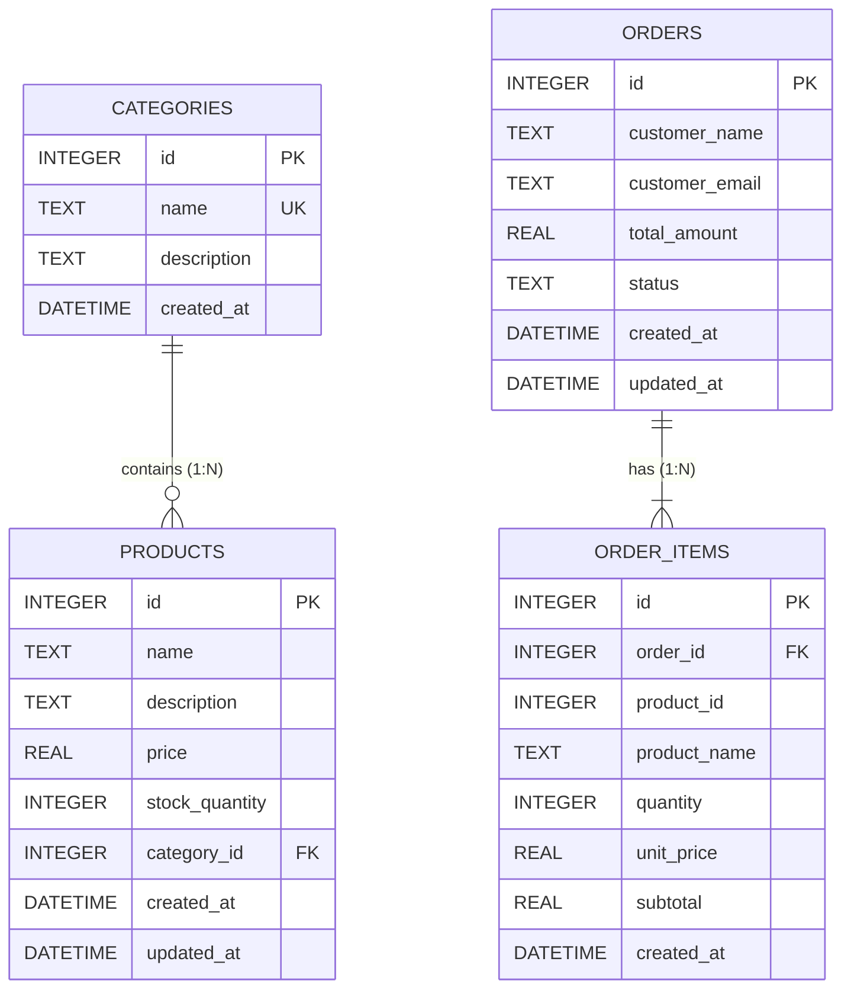

# SBSMA Project: Scalable Backend System using Microservices

**Date:** 21/09/2026  
**System Architecture:** Scalable E-Commerce Backend Platform with Independent Microservices & REST Communication

---

## 📑 Table of Contents
1. [Part A: System Design](#part-a-system-design)
   - [1. Overall Microservices Architecture Diagram](#1-overall-microservices-architecture-diagram)
   - [2. Core Independent Microservices](#2-core-independent-microservices)
   - [3. Service Responsibilities](#3-service-responsibilities)
   - [4. API Flow Diagram (Inter-Service Sequence)](#4-api-flow-diagram)
2. [Part B: Database Design](#part-b-database-design)
   - [Database-per-Service Architecture](#database-per-service-architecture)
   - [Product Service Database (`product_service.db`)](#product-service-database)
   - [Order Service Database (`order_service.db`)](#order-service-database)
   - [Entity Relationship Diagram](#entity-relationship-diagram)
3. [Part C: Development & Implementation](#part-c-development--implementation)
   - [Technology Stack](#technology-stack)
   - [CRUD Operations Mapping](#crud-operations-mapping)
   - [Inter-Service REST Communication Pattern](#inter-service-rest-communication-pattern)
4. [Part D: API Documentation](#part-d-api-documentation)
   - [Product Service API Specs](#product-service-api-specs)
   - [Order Service API Specs](#order-service-api-specs)
   - [Standard Request/Response Envelope & Error Codes](#standard-requestresponse-envelope--error-codes)
   - [Interactive Swagger UI](#interactive-swagger-ui)
5. [Part E: Testing](#part-e-testing)
   - [Automated Integration Test](#automated-integration-test)
   - [Postman Collection Guide](#postman-collection-guide)
   - [Test Cases (PUT, POST, GET, DELETE)](#test-cases)
6. [Quickstart Guide](#quickstart-guide)

---

## Part A: System Design

### 1. Overall Microservices Architecture Diagram

```mermaid
flowchart TB
    Client["Client / Mobile App / Web / Postman"]
    
    subgraph Gateway["API Gateway / Routing Layer"]
        GW["Reverse Proxy / Port Router"]
    end

    subgraph ProductMicroservice["Microservice 1: Product Catalog & Inventory Service (Port 5001)"]
        PApi["Product REST API (/api/products)"]
        PDB[("product_service.db\n(SQLite)")]
        PApi --> PDB
    end

    subgraph OrderMicroservice["Microservice 2: Order Processing Service (Port 5002)"]
        OApi["Order REST API (/api/orders)"]
        ODB[("order_service.db\n(SQLite)")]
        OApi --> ODB
    end

    subgraph ExtensibleServices["Core Scalable Microservices Ecosystem"]
        UserService["Customer / Auth Service (Port 5003)"]
        PaymentService["Notification & Payment Service (Port 5004)"]
    end

    Client --> GW
    GW -->|Port 5001| PApi
    GW -->|Port 5002| OApi

    %% Inter-service HTTP Communication
    OApi -->|HTTP GET /api/products/:id\n(Stock check)| PApi
    OApi -->|HTTP POST /api/products/:id/reserve-stock\n(Inventory Reservation)| PApi
    OApi -.->|HTTP POST /api/products/:id/release-stock\n(Compensation / Cancellation)| PApi
```

### 2. Core Independent Microservices

In our real-world E-Commerce scalable backend design, we identify **four core independent microservices**:
1. **Product Catalog & Inventory Service (`product-service`)**: Manages products, classifications, stock tracking, and pricing.
2. **Order Management Service (`order-service`)**: Handles customer carts, checkout processing, order lifecycle, and status tracking.
3. **Customer & Auth Service (`customer-service`)**: Manages customer profiles, addresses, authentication tokens, and access control.
4. **Notification & Payment Service (`notification-payment-service`)**: Handles payment gateway handshakes, transactional invoices, and email/SMS order alerts.

*(In this implemented project, **Microservice 1 (Product Service)** and **Microservice 2 (Order Service)** are fully coded, equipped with separate databases, and actively communicate with each other over REST APIs).*

### 3. Service Responsibilities

| Microservice | Single Business Responsibility | Data Ownership |
| :--- | :--- | :--- |
| **Product Service** | Single source of truth for products, categories, item descriptions, and stock quantities. Ensures atomicity when reserving or releasing stock. | Owns `product_service.db` (`products`, `categories`). No other service can write directly to its database. |
| **Order Service** | Orchestrates checkout flows, validates order items by querying the Product Service, reserves inventory, and tracks order status (PENDING, CONFIRMED, CANCELLED). | Owns `order_service.db` (`orders`, `order_items`). Does not mutate product tables directly. |

### 4. API Flow Diagram



---

## Part B: Database Design

### Database-per-Service Architecture
In accordance with microservice design principles, each microservice possesses a **dedicated, decoupled database**. Services never share database connections or tables.

### Product Service Database (`product_service.db`)

#### Table: `categories`
| Column | Type | Constraints | Description |
| :--- | :--- | :--- | :--- |
| `id` | INTEGER | **PRIMARY KEY** AUTOINCREMENT | Unique Category ID |
| `name` | TEXT | NOT NULL, UNIQUE | Category name (e.g., Electronics) |
| `description` | TEXT | NULLABLE | Category description |
| `created_at` | DATETIME | DEFAULT CURRENT_TIMESTAMP | Record creation timestamp |

#### Table: `products`
| Column | Type | Constraints | Description |
| :--- | :--- | :--- | :--- |
| `id` | INTEGER | **PRIMARY KEY** AUTOINCREMENT | Unique Product ID |
| `name` | TEXT | NOT NULL | Product Title |
| `description` | TEXT | NULLABLE | Product detailed description |
| `price` | REAL | NOT NULL | Unit price (decimal) |
| `stock_quantity`| INTEGER | NOT NULL DEFAULT 0 | Available inventory |
| `category_id` | INTEGER | **FOREIGN KEY** -> `categories(id)` | Associated category |
| `created_at` | DATETIME | DEFAULT CURRENT_TIMESTAMP | Creation timestamp |
| `updated_at` | DATETIME | DEFAULT CURRENT_TIMESTAMP | Last modified timestamp |

---

### Order Service Database (`order_service.db`)

#### Table: `orders`
| Column | Type | Constraints | Description |
| :--- | :--- | :--- | :--- |
| `id` | INTEGER | **PRIMARY KEY** AUTOINCREMENT | Unique Order ID |
| `customer_name` | TEXT | NOT NULL | Customer full name |
| `customer_email`| TEXT | NOT NULL | Customer email address |
| `total_amount` | REAL | NOT NULL | Order total price |
| `status` | TEXT | NOT NULL DEFAULT 'PENDING' | PENDING, CONFIRMED, CANCELLED |
| `created_at` | DATETIME | DEFAULT CURRENT_TIMESTAMP | Order creation timestamp |
| `updated_at` | DATETIME | DEFAULT CURRENT_TIMESTAMP | Status update timestamp |

#### Table: `order_items`
| Column | Type | Constraints | Description |
| :--- | :--- | :--- | :--- |
| `id` | INTEGER | **PRIMARY KEY** AUTOINCREMENT | Unique Order Item ID |
| `order_id` | INTEGER | **FOREIGN KEY** -> `orders(id)` ON DELETE CASCADE | Associated order ID |
| `product_id` | INTEGER | NOT NULL | Reference to Product Service |
| `product_name` | TEXT | NOT NULL | Snapshot of product title |
| `quantity` | INTEGER | NOT NULL | Quantity ordered |
| `unit_price` | REAL | NOT NULL | Snapshot of unit price |
| `subtotal` | REAL | NOT NULL | `quantity * unit_price` |
| `created_at` | DATETIME | DEFAULT CURRENT_TIMESTAMP | Timestamp |

### Entity Relationship Diagram



---

## Part C: Development & Implementation

### Technology Stack
- **Runtime:** Node.js (v24.x)
- **Framework:** Express.js
- **Database Engine:** Embedded SQLite (`node:sqlite`), zero external server setup required
- **API Protocol:** REST over HTTP/JSON
- **API Documentation:** OpenAPI 3.0 / Swagger UI (`swagger-ui-express`)
- **Testing:** Postman Collection v2.1 + Node.js End-to-End Automated Test Suite

### CRUD Operations Mapping

| Service | CRUD Operation | HTTP Method | Endpoint URL | Description |
| :--- | :--- | :--- | :--- | :--- |
| **Product** | **Create** | `POST` | `/api/products` | Create a new product in inventory |
| **Product** | **Read (All)**| `GET` | `/api/products` | Get list of all available products |
| **Product** | **Read (One)**| `GET` | `/api/products/:id` | Get details and stock of a specific product |
| **Product** | **Update** | `PUT` | `/api/products/:id` | Update product details, price, or stock |
| **Product** | **Delete** | `DELETE` | `/api/products/:id` | Remove a product from the database |
| **Product** | *Inter-Service*| `POST` | `/api/products/:id/reserve-stock` | Atomically decrement stock when order placed |
| **Product** | *Inter-Service*| `POST` | `/api/products/:id/release-stock` | Increment stock when order cancelled |
| **Order** | **Create** | `POST` | `/api/orders` | Place order (Triggers inter-service stock reservation) |
| **Order** | **Read (All)**| `GET` | `/api/orders` | List all customer orders with line items |
| **Order** | **Read (One)**| `GET` | `/api/orders/:id` | Fetch order details by ID |
| **Order** | **Update** | `PUT` | `/api/orders/:id/status` | Update status (CANCELLED releases stock back) |
| **Order** | **Delete** | `DELETE` | `/api/orders/:id` | Delete order record |

---

## Part D: API Documentation

### Standard Request/Response Envelope & Error Codes

All microservices respond with a uniform structure:

#### Success Response Envelope (`200 OK`, `201 Created`)
```json
{
  "success": true,
  "message": "Order created and stock successfully reserved",
  "data": {
    "id": 1,
    "customer_name": "Jane Doe",
    "total_amount": 239.97,
    "status": "CONFIRMED",
    "items": [ ... ]
  },
  "timestamp": "2026-09-21T10:15:00.000Z"
}
```

#### Error Response Envelope (`400`, `404`, `409`, `500`, `502`)
```json
{
  "success": false,
  "error": {
    "code": "INSUFFICIENT_STOCK",
    "message": "Cannot place order: Product 'Wireless Optical Mouse' only has 2 units available (requested 10)."
  },
  "timestamp": "2026-09-21T10:15:00.000Z"
}
```

#### Standard Error Codes:
- `400 Bad Request`: `VALIDATION_ERROR` (Missing fields, negative price or quantity).
- `404 Not Found`: `PRODUCT_NOT_FOUND`, `ORDER_NOT_FOUND`, `ROUTE_NOT_FOUND`.
- `409 Conflict`: `INSUFFICIENT_STOCK`, `CATEGORY_EXISTS`.
- `502 Bad Gateway`: `PRODUCT_SERVICE_UNAVAILABLE` (Inter-service network failure).
- `500 Internal Server Error`: `INTERNAL_SERVER_ERROR`.

---

### Interactive Swagger UI
Both microservices serve interactive Swagger UI documentation:
- **Product Service Swagger Docs:** `http://localhost:5001/api-docs`
- **Order Service Swagger Docs:** `http://localhost:5002/api-docs`

---

## Part E: Testing

### 1. Automated Integration Test Suite
You can execute the complete end-to-end integration test with:
```bash
npm run test:flow
```
This script validates:
1. Both services are running and healthy (`GET /health`).
2. Creates a product via `POST /api/products`.
3. Reads product via `GET /api/products/:id`.
4. Updates product price via `PUT /api/products/:id`.
5. Places an order via `POST /api/orders` (verifying that `order-service` calls `product-service` and stock decreases).
6. Attempts an over-stock order to verify `409 Conflict` error handling.
7. Cancels the order via `PUT /api/orders/:id/status` and verifies stock restoration in `product-service`.
8. Tests `GET /api/orders` and `DELETE /api/orders/:id`.

### 2. Postman Collection Guide
A ready-to-import Postman Collection file is provided at:
`./postman_collection.json`

**How to test using Postman:**
1. Open Postman.
2. Click **Import** and select `postman_collection.json`.
3. The collection is organized into two folders:
   - **Product Service (Port 5001)**: Test GET, POST, PUT, DELETE, and stock endpoints.
   - **Order Service (Port 5002)**: Test GET, POST, PUT, DELETE, and out-of-stock conflict tests.

---

## Quickstart Guide

### 1. Start Both Microservices
Run the following command in the project directory:
```bash
npm start
```
This launches:
- `product-service` on `http://localhost:5001`
- `order-service` on `http://localhost:5002`

### 2. Run Automated Verification Tests
In a separate terminal:
```bash
npm run test:flow
```
